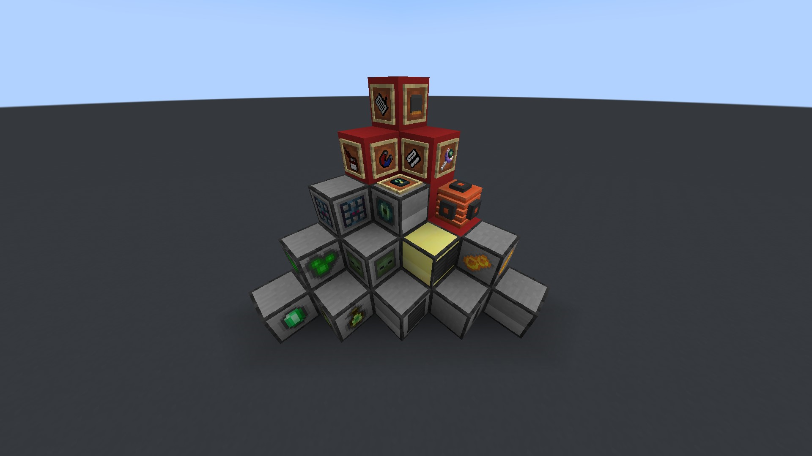

# Welcome to the More Peripherals Docs
---

More peripherals is a addon mod for [CC:Tweaked](https://www.curseforge.com/minecraft/mc-mods/cc-tweaked) adding new peripherals and some tools, focusing on allowing the player to interact with vanilla features in a new and automatable way.

Any issues can be reported to the [issues page](https://github.com/JheffersonMarques/MorePeripherals/issues) on github, and you can also check the [changelogs](https://github.com/JheffersonMarques/MorePeripherals/blob/1.20/changelog.md).

